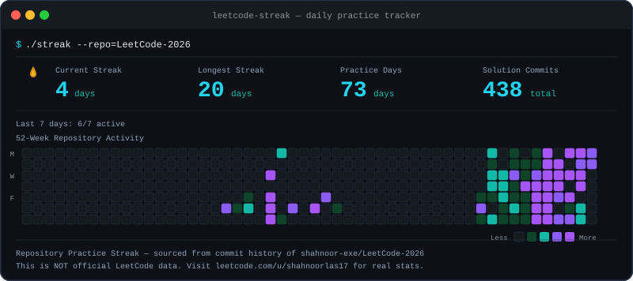

<div align="center">

<!-- HEADER BANNER -->


<!-- TYPING SVG -->
<a href="https://github.com/shahnoor-exe">

</a>

</div>

<!-- PROFILE BADGES -->
<p align="center">
  
  &nbsp;
  <a href="https://github.com/shahnoor-exe?tab=followers"></a>
  &nbsp;
  <a href="https://github.com/shahnoor-exe?tab=repositories"></a>
</p>

---

<!-- ═══════════════════════════════════════════════════════════════════════════ -->
<!-- HERO SECTION: Portrait + Neofetch Profile Card                           -->
<!-- ═══════════════════════════════════════════════════════════════════════════ -->

<div align="center">
<table>
<tr>
<td width="42%" align="center">
  <picture>
    <source media="(prefers-reduced-motion: reduce)" srcset="./assets/portrait-ascii-static.svg?v=6" />
    
  </picture>
</td>
<td width="58%" align="center">
  
</td>
</tr>
</table>
</div>

---

<!-- ═══════════════════════════════════════════════════════════════════════════ -->
<!-- ABOUT ME                                                                  -->
<!-- ═══════════════════════════════════════════════════════════════════════════ -->

## `> whoami`

<br/>

```javascript
const shahnoor = {
    name: "Shahnoor Ahmed Laskar",
    role: "AI/ML Developer & Full-Stack Engineer",
    university: "Chandigarh University",
    degree: "B.E. CSE (Honors) — Data Science",
    cgpa: 8.04,
    graduating: 2028,

    domains: [
        "Machine Learning & Deep Learning",
        "Full-Stack Web & Mobile Development",
        "Data Science & Analytics",
        "IoT & Sensor Systems"
    ],

    achievements: [
        "Patent Filed: Adaptive Fog Light System",
        "JEE Mains Qualified → NIT Silchar (ECE)",
        "National Math Olympiad Phase 1 Cleared",
        "2 Hackathon Projects (CoderPirates)"
    ],

    currentFocus: "Advanced AI Systems & Data Science",
    funFact: "I bridge tech innovation with ops efficiency",

    build() {
        return "scalable intelligent systems";
    }
};
```

```bash
$ status --current
> Advanced AI Systems & Data Science

$ uptime
> B.E. CSE (Honors) — Class of 2028
> Chandigarh University | CGPA 8.04

$ cat interests.txt
> AI-driven applications
> Open-source development
> Hackathons & system design
> Production-grade intelligent systems
```

<br/>

<p align="center">
  <a href="https://github.com/shahnoor-exe">
    
  </a>
</p>

<br/>

---

<!-- ═══════════════════════════════════════════════════════════════════════════ -->
<!-- TECH ARSENAL                                                              -->
<!-- ═══════════════════════════════════════════════════════════════════════════ -->

## `> cat tech-stack.yml`

<div align="center">

#### Languages

<p>


</p>

#### Frameworks & AI/ML

<p>


</p>

#### Tools & Platforms

<p>


</p>

</div>

<br/>

---

<!-- ═══════════════════════════════════════════════════════════════════════════ -->
<!-- FEATURED PROJECTS                                                         -->
<!-- ═══════════════════════════════════════════════════════════════════════════ -->

## `> ls -la ./projects/`

<table>
<tr>
<td width="50%">

### AgroGuard AI — Smart Agriculture Platform `2026`
> **Full-Stack AI + Flutter + Gov API Integration** | Hackathon *(CoderPirates)*

Production-ready smart farming platform for Indian farmers combining AI/ML, IoT sensor monitoring, and integration with 5 government agricultural portals in 5 regional languages.

| Feature | Details |
|---|---|
| AI Crop Rec. | RandomForest · 7 soil/weather inputs |
| Disease Detection | CNN · 40+ diseases |
| IoT Dashboard | 9 real-time sensor metrics |
| Govt Portals | eNAM · Agmarknet · mKisan · PMFBY |
| Multi-Language | EN · HI · PA · TA · BN |

**Stack:** `Python` `Flask` `scikit-learn` `TensorFlow` `Flutter` `Dart` `SQLite`

[](https://github.com/shahnoor-exe/AgroGuard-AI)

</td>
<td width="50%">

### Ann-Sanjivani AI — Food Rescue Platform `2026`
> **FastAPI + React 18 + 4 ML Models** | Hackathon *(CoderPirates)*

Production-grade food rescue platform connecting surplus-food restaurants with NGOs, powered by 4 ML models, WebSocket real-time tracking, and multilingual dark-mode UI.

| Feature | Details |
|---|---|
| Surplus Prediction | XGBoost · 6 real features |
| Route Optimization | OR-Tools VRP + 2-opt solver |
| Food Classification | IndicBERT NLP + ViT |
| ETA Prediction | Keras LSTM sequence model |
| Real-Time Tracking | WebSocket + Firebase GPS |

**Stack:** `Python` `FastAPI` `React 19` `TypeScript` `TailwindCSS` `XGBoost` `OR-Tools` `Appwrite`

[](https://github.com/shahnoor-exe/Ann-Sanjivani-AI)

</td>
</tr>
<tr>
<td width="50%">

### ExoPlanet Detection — AI Classifier `2026`
> **FastAPI + XGBoost + React 19 + Tailwind CSS** | AI/ML + Full-Stack

End-to-end AI exoplanet detection system using NASA Kepler light-curve data. Upload stellar flux CSV data and get XGBoost-powered classification with probability scores.

| Feature | Details |
|---|---|
| ML Model | XGBoost · configurable detection threshold |
| CSV Pipeline | Upload → preprocess → predict → stream |
| Space-Themed UI | Vite 6 · React 19 · Tailwind animations |
| Live Deployment | Vercel frontend · Replit backend |

**Stack:** `Python` `FastAPI` `XGBoost` `React 19` `TypeScript` `TailwindCSS`

[](https://github.com/shahnoor-exe/exoplanet-backend)
[](https://exoplanet-frontend-ten.vercel.app)

</td>
<td width="50%">

### ChainGuard `2026`
> **Supply Chain Management System**

Comprehensive system for managing and securing supply chain processes.

**Stack:** `JavaScript`

[](https://github.com/shahnoor-exe/ChainGuard)
[](https://chain-guard-olive.vercel.app)

---

### OmNaad `2026`
> **Omni-Channel AI Communication Platform** | Bank of India | PSBs Hackathon IDEA 2.0

**Stack:** `TypeScript`

[](https://github.com/shahnoor-exe/omnaad)

---

### SAMVID-Insur-AI `2026`
> **AI Insurance Assistant**

Smart AI assistant designed for the insurance domain.

**Stack:** `TypeScript`

[](https://github.com/shahnoor-exe/SAMVID-Insur-AI)
[](https://samvid-insur-ai.vercel.app)

</td>
</tr>
</table>

<table>
<tr>
<td width="33%" align="center">

### Adaptive Vehicle Fog Light System `2025`
> **Patent Filed** | Sensors & Hardware

Automated fog-light system that dynamically adjusts intensity based on visibility sensors to enhance vehicle safety in low-visibility conditions.

`IoT` `Sensors` `Hardware` `Patent`

</td>
<td width="33%" align="center">

### Dreamforge — AI Career Guidance `2025`
> **Application Development**

AI-driven career counselling application assisting students in choosing career paths based on skills and interests.

`Python` `AI/ML` `Application Dev`

</td>
<td width="33%" align="center">

### Security Flaws in TOR Network `2024`
> **Cybersecurity Analysis**

Theoretical analysis of de-anonymisation attacks and security vulnerabilities within the TOR network.

`Cybersecurity` `Research` `Analysis`

</td>
</tr>
</table>

<br/>

---

<!-- ═══════════════════════════════════════════════════════════════════════════ -->
<!-- DAILY GRIND — LEETCODE 2026                                               -->
<!-- ═══════════════════════════════════════════════════════════════════════════ -->

## `$ ./streak --repo=LeetCode-2026`

<div align="center">

<table>
<tr>
<td width="50%" align="center">

#### LeetCode Account Stats

<a href="https://leetcode.com/u/shahnoorlas17/">

</a>

<br/>

<a href="https://leetcode.com/u/shahnoorlas17/">

</a>

</td>
<td width="50%" align="center">

#### Repository Practice Streak

<a href="https://github.com/shahnoor-exe/LeetCode-2026">

</a>

<br/>

<a href="https://github.com/shahnoor-exe/LeetCode-2026">

</a>

</td>
</tr>
</table>

</div>

<br/>

---

<!-- ═══════════════════════════════════════════════════════════════════════════ -->
<!-- PROFESSIONAL EXPERIENCE                                                   -->
<!-- ═══════════════════════════════════════════════════════════════════════════ -->

## `> cat experience.log`

<table>
<tr>
<td>

**Field Operations Manager** @ *Total Home Care Solutions LLC* &nbsp; `Jan 2025 – Aug 2025`
> Managing daily field service operations and optimising technician schedules using data-driven workflows.

**Sales Executive Manager & Technical Operator** @ *Glamarode (Startup)* &nbsp; `May 2025 – Jul 2025`
> Led client engagement strategies and managed backend technical operations, bridging sales and technology.

</td>
</tr>
</table>

<br/>

---

<!-- ═══════════════════════════════════════════════════════════════════════════ -->
<!-- ACHIEVEMENTS                                                              -->
<!-- ═══════════════════════════════════════════════════════════════════════════ -->

## `> cat achievements.md`

<div align="center">
<table>
<tr>
<td align="center" width="33%">
<br/>
<b>JEE Mains & Advanced</b><br/>
Secured ECE seat at <b>NIT Silchar</b>
</td>
<td align="center" width="33%">
<br/>
<b>National Math Olympiad</b><br/>
Cleared Phase 1 — National Level
</td>
<td align="center" width="33%">
<br/>
<b>Adaptive Fog Light</b><br/>
Patent filed for automotive safety
</td>
</tr>
</table>
</div>

<br/>

---

<!-- ═══════════════════════════════════════════════════════════════════════════ -->
<!-- CERTIFICATIONS                                                            -->
<!-- ═══════════════════════════════════════════════════════════════════════════ -->

## `> ls certifications/`

<div align="center">
<p>

&nbsp;

&nbsp;

</p>
</div>

<br/>

---

<!-- ═══════════════════════════════════════════════════════════════════════════ -->
<!-- GITHUB ANALYTICS                                                          -->
<!-- ═══════════════════════════════════════════════════════════════════════════ -->

## `> git log --stat`

<div align="center">
<table>
<tr>
<td align="center" width="50%">


</td>
<td align="center" width="50%">


</td>
</tr>
</table>
</div>

<br/>

<!-- CONTRIBUTION CALENDAR -->
<div align="center">

### `> contributions --year=2024-2026`


</div>

<br/>

<!-- GITHUB TROPHIES -->
<div align="center">


</div>

<br/>

<!-- CONTRIBUTION SNAKE -->
<div align="center">

<picture>
  <source media="(prefers-color-scheme: dark)" srcset="https://raw.githubusercontent.com/shahnoor-exe/shahnoor-exe/output/github-snake-dark.svg" />
  <source media="(prefers-color-scheme: light)" srcset="https://raw.githubusercontent.com/shahnoor-exe/shahnoor-exe/output/github-snake.svg" />
  
</picture>

</div>

<br/>

<!-- ACTIVITY GRAPH -->
<div align="center">

[](https://github.com/shahnoor-exe)

</div>

<br/>

---

<!-- ═══════════════════════════════════════════════════════════════════════════ -->
<!-- CONNECT WITH ME                                                           -->
<!-- ═══════════════════════════════════════════════════════════════════════════ -->

## `> cat contacts.yml`

<div align="center">
<p>

<a href="https://www.linkedin.com/in/shahnoor-laskar-02a0192bb/">

</a>
&nbsp;
<a href="mailto:laskarshahnoor@gmail.com">

</a>
&nbsp;
<a href="https://www.instagram.com/screwy_lad/">

</a>
&nbsp;
<a href="https://wa.me/918486654731">

</a>
&nbsp;
<a href="https://shahnoor-exe.github.io/">

</a>
&nbsp;
<a href="https://github.com/shahnoor-exe">

</a>
&nbsp;
<a href="https://leetcode.com/u/shahnoorlas17/">

</a>

</p>
</div>

<br/>

---

<!-- ═══════════════════════════════════════════════════════════════════════════ -->
<!-- WORDS I LIVE BY                                                           -->
<!-- ═══════════════════════════════════════════════════════════════════════════ -->

<div align="center">



</div>

<br/>

<!-- FOOTER WAVE -->

